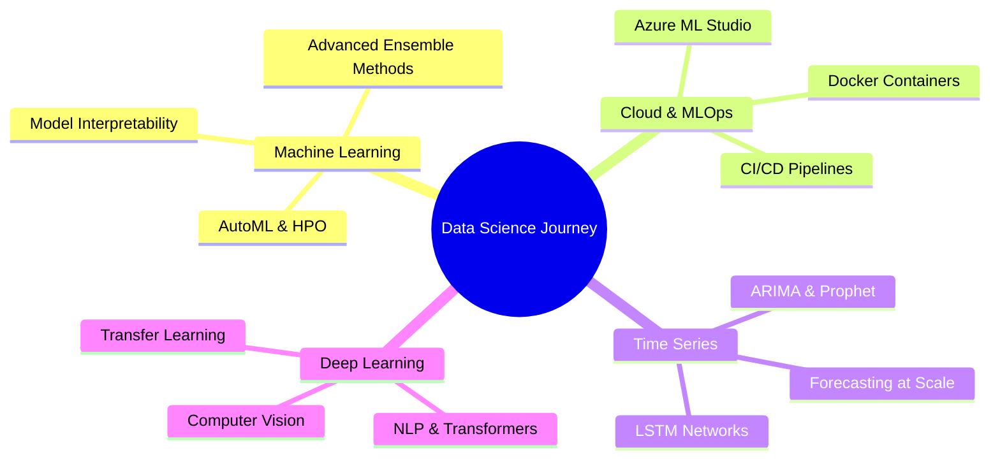

<div align="center">
  
  <!-- Dynamic Typing Header -->
  
  
  <br/>
  
  <!-- Subtitle -->
  <p>
    <strong>M.S. Data Science candidate • ME / Analytics • Python • SQL • Tableau / Power BI • Azure</strong>
  </p>
  
  <!-- Location & Contact -->
  <p>
    📍 Canada/USA • 
    <a href="https://www.linkedin.com/in/paramdeepnijjer/" target="_blank">
      
    </a> • 
    <a href="https://github.com/paramdeepnijjer-blip">
      
    </a> • 
    <a href="mailto:paramdeep.nijjer@gmail.com">
      
    </a>
  </p>
  
  <!-- Visitor Counter -->
  <p>
    
  </p>

</div>

---

## 🚀 About Me

I'm Param — an M.S. Data Science candidate with a strong foundation in Applied Statistics and hands-on experience building end-to-end analytics and ML projects. I turn messy, real-world data into clean pipelines, trustworthy models, and dashboards that drive decisions.

I care about **performance and the story**: feature engineering, evaluation, interpretability, and explaining results clearly to non-technical stakeholders. My portfolio focuses on: **data + modeling → evaluation → decision outputs**.

```python
class DataScientist:
    def __init__(self):
        self.name = "Param"
        self.role = "Data Science Graduate Student"
        self.education = "M.S. Data Science"
        self.interests = ["Machine Learning", "Time Series", "Cloud ML", "Data Viz"]
        
    def say_hi(self):
        print("Thanks for dropping by! Let's build something amazing together.")

me = DataScientist()
me.say_hi()
```

---

## 🧠 Expertise

<table>
<tr>
<td width="50%">

### Machine Learning & AI
- 🎯 Feature engineering & selection
- 📊 Model evaluation & interpretability
- 🔮 Predictive modeling (regression, classification, clustering)
- 🤖 Deep learning (CNNs, RNNs, transformers)
- ⏱️ Time series forecasting

</td>
<td width="50%">

### Data Engineering & Analytics
- 📈 ETL pipelines & data cleaning
- 📊 Reporting automation & dashboards
- ☁️ Cloud deployment (Azure)
- 🔄 Reproducible workflows (Git)
- 💾 SQL & database design

</td>
</tr>
</table>

---

## 🛠️ Tech Stack

<div align="center">

### Languages & Tools

<p>
  <!-- Languages -->
  
  
  
</p>

### ML & Data Science

<p>
  
  
  
  
</p>

### Visualization & BI

<p>
  
  
  
  
  
</p>

### Cloud & DevOps

<p>
  
  
  
</p>

### Databases

<p>
  
  
  
  
</p>

</div>

---

## ⭐ Featured Projects

<div align="center">

<a href="https://github.com/paramdeepnijjer-blip/shopLens-ai">
  
</a>

<a href="https://github.com/paramdeepnijjer-blip/ev-range-prediction">
  
</a>

<a href="https://github.com/paramdeepnijjer-blip/appointments-forecasting">
  
</a>

<a href="https://github.com/paramdeepnijjer-blip/airbnb-seattle-pricing">
  
</a>

</div>

### 🔥 Highlights

- **🛍️ ShopLens AI** — AI product background generator with diffusion models
- **⚡ EV Range Prediction** — End-to-end ML pipeline with interpretability
- **📅 Appointments Forecasting** — Time series forecasting with evaluation metrics
- **🏠 Airbnb Seattle Pricing** — Tableau insights + ML story

<sup>*Pro these repos on your profile (repos below)*</sup>

---

## 📊 GitHub Stats

<div align="center">
  
  <!-- GitHub Stats Card -->
  
  
  <!-- Top Languages Card -->
  

</div>

<div align="center">
  
  <!-- GitHub Streak Stats -->
  

</div>

<div align="center">
  
  <!-- Trophy Stats -->
  

</div>

<div align="center">
  
  <!-- Activity Graph -->
  

</div>

---

## 📈 Contribution Stats

<div align="center">


<table>
<tr>
<td>

</td>
<td>

</td>
</tr>
<tr>
<td>

</td>
<td>

</td>
</tr>
</table>

</div>

---

## 🎯 Current Focus



---

## 💡 Fun Facts

- 🎓 Currently pursuing M.S. in Data Science
- 📊 I believe good visualizations tell stories that numbers alone cannot
- ☁️ Passionate about deploying ML models to production
- 🔍 Always exploring new techniques in feature engineering
- 💬 Ask me about time series forecasting, ML pipelines, or cloud deployment
- ⚡ Fun fact: I spend more time cleaning data than modelling (and that's okay!)

---

## 📫 Let's Connect

<div align="center">

I'm always open to interesting conversations and collaboration opportunities!

<p>
  <a href="https://www.linkedin.com/in/paramdeepnijjer/" target="_blank">
    
  </a>
  <a href="mailto:paramdeep.nijjer@gmail.com">
    
  </a>
  <a href="https://github.com/paramdeepnijjer-blip">
    
  </a>
</p>

<p>
  <strong>💼 Open to: Full-time Data Science roles | ML/Data Engineering positions | Junior Product Management
</p>

</div>

---

<div align="center">
  
  ### 🌟 "Turning data into decisions, one model at a time" 🌟
  
  
  
</div>
